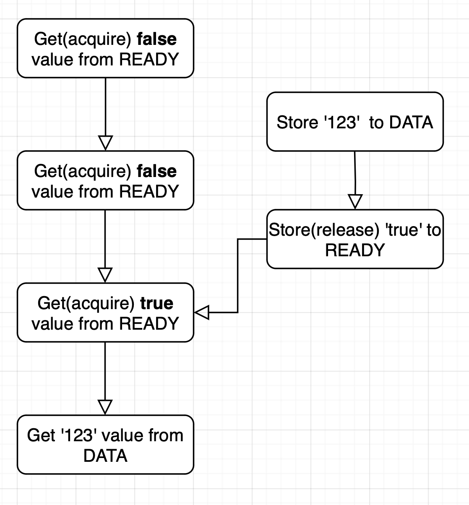

# What is memory ordering?

Memory Ordering is an important concpets in multithreaded programming, which refers to how to control the order of memory accesses when multiple threads access memory.
Memory ordering plays a particularly important role in parallel programming and hardware.

# Memory ordering types
There are three types of `memory ordering`.
1. Relaxed
2. Release-Acquired
3. SeqCst(Sequentially consistent)

## Relaxed
Relaxed memory ordering does not have `happens-before relationship`, but total modification order in which the values of individual atomic variables change is always  guaranteed.
Changing same atomic variable are executed in order. 

Example of a(), b() being executed concurrent execution by diffrent threads.
```rust
use std::sync::atomic::AtomicI32;
use std::sync::atomic::Ordering::Relaxed;

static X: AtomicI32 = AtomicI32::new(0);

fn a() {
    X.fetch_add(5, Relaxed);
    X.fetch_add(10, Relaxed);
}

fn b() {
    let a = X.load(Relaxed);
    let b = X.load(Relaxed);
    let c = X.load(Relaxed);
    let d = X.load(Relaxed);
    println!("{}, {}, {} ,{}", a, b, c, d);
}
```
This example only changes a single value, so you can see that the values of X change in order.
If you look at the X value in another thread, you might see that `0, 0, 0, 0`, `0, 0, 5, 15`, but not `0, 5, 0, 15`, `0, 0, 10 15`.

As another exmaple, let's split a() function into a1() and a2() and execute them in diffrent threads.
```rust
fn a1() {
    X.fetch_add(5, Relaxed);
}

fn a2() {
    X.fetch_add(10, Relaxed);
}
```
This example you couldn't know in what order these values will change.
If you want to use atomic variable it more complex, You need to strict rules.

## Release Ordering and Acquire Ordering
You can use `Release-Acquire` ordering for make happens-before relationship.
Release memory ordering applies for write operation and Acquire memory ordering applies read operation.

Happens-before reliation is created when `acquire-load` operation observes the result of `release-store` opreation. The write operation and all operations before it are executed, then the read opeartion and all operation after it are executed.

Acquire is only applied to the part of `fetch-and-modify` or `compare-and-exchange` opeartion that fetched a value.
Simillary, `Release` is only applied to the part of write a value.
AcqRel is composite expresion of `Acquire` and `Release`.

This example, the created thread sends an integer to the main thread.

```rust
use std::sync::atomic::{AtomicBool, AtomicI32};
use std::sync::atomic::Ordering::{Acquire, Relaxed, Release};
use std::thread;
use std::thread::spawn;
use std::time::Duration;

static DATA: AtomicI32 = AtomicI32::new(0);
static READY: AtomicBool = AtomicBool::new(false);

fn main() {
    thread::spawn(|| {
        DATA.store(123, Relaxed);
        READY.store(true, Release);
    });
    while !READY.load(Acquire) {
        thread::sleep(Duration::from_millis(100));
        println!("waiting...");
    }
    println!("{}", DATA.load(Relaxed));
}
```
When the creation thread finished to storing data, set the READY flag to true using `release-store`.
When main thread checks via `acquire-load`, happens-before relationship is created between two operations.



At this point, everyting that before happened changing release-store to READY will show up in everything that after happeened acquire-laod.

In this exmaple, there is only one result, '123'.

If you use Relaxed memory ordering about all opeartions in this example, you might see READY changes to true on the main thread, and DATA value still loads 0.

## Sequentially Consistent Ordering
The most powerful memory ordering is `Ordering::SeqCst`(Sequentially consistent ordering)
Acquire ordering for load opeartion, release ordering for store opeartion and a globally consistent order of operations are all guaranteed.

 It is a restriction condition that is much stronger than acquire and release memory ordering.